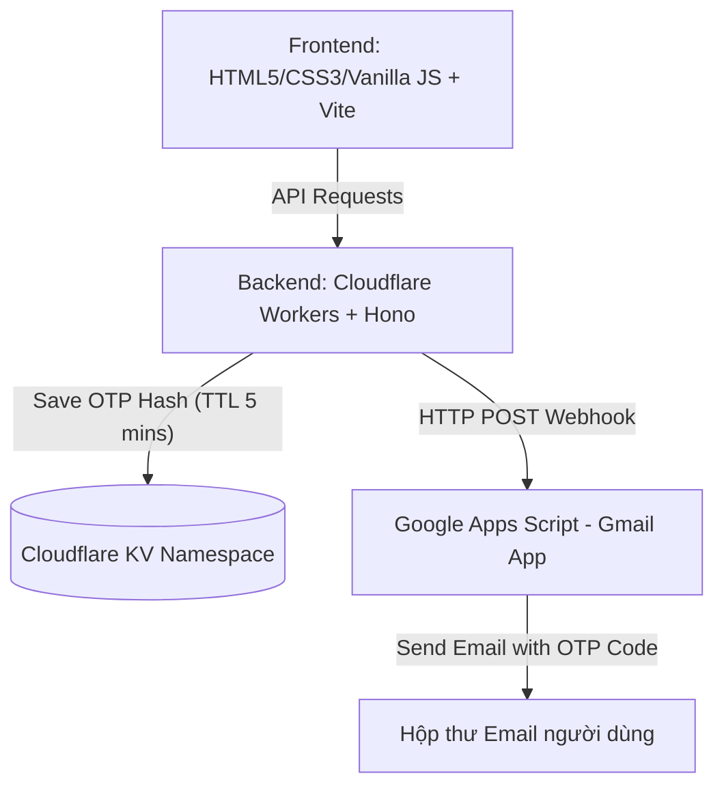
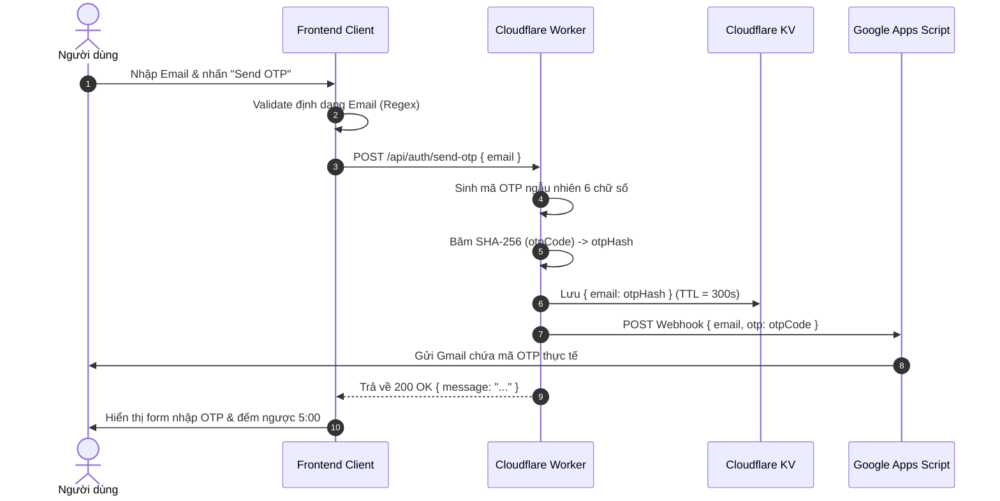
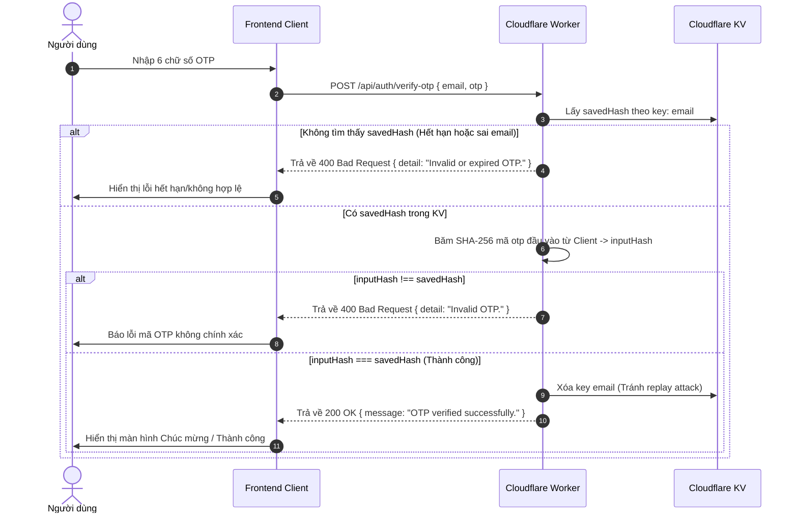

# Tài Liệu Đặc Tả & Hướng Dẫn Phát Triển (AGENT.md)

Tài liệu này cung cấp thông tin đặc tả hệ thống, kiến trúc ứng dụng, cấu trúc dữ liệu, và hướng dẫn chi tiết dành cho các lập trình viên hoặc AI Agent tham gia phát triển, bảo trì ứng dụng **Xác thực Email bằng mã OTP**.

---

## 1. Tổng Quan Hệ Thống

Hệ thống cung cấp cơ chế xác thực danh tính người dùng thông qua Email bằng cách gửi mã OTP (One-Time Password) ngẫu nhiên 6 chữ số có hiệu lực trong vòng **5 phút**.

### Mô Hình Kiến Trúc (Architecture)

Ứng dụng được xây dựng trên mô hình phi tập trung/không máy chủ (Serverless) cực kỳ tối ưu:



### Thành phần chính:
1. **Frontend (Vite / Vanilla JS)**: Giao diện người dùng hiện đại, thiết kế theo ngôn ngữ Glassmorphism (Kính mờ) sang trọng, chịu trách nhiệm nhận email từ người dùng, hiển thị ô nhập mã OTP dạng phân tách (6 ô độc lập), và quản lý thời gian đếm ngược (countdown timer).
2. **Backend (Cloudflare Worker + Hono)**: Xử lý logic nghiệp vụ, tạo OTP ngẫu nhiên, thực hiện băm SHA-256 mã OTP để lưu trữ bảo mật vào Cloudflare KV với thời gian hết hạn tự động (Expiration TTL = 300s).
3. **Google Apps Script (GAS) Webhook**: Đóng vai trò là mail client trung gian kết nối với Gmail API của Google để gửi email chứa mã OTP đến người dùng một cách chính xác mà không tốn phí duy trì server gửi mail.

---

## 2. Quy Trình Luồng Dữ Liệu (Data Flows)

### A. Quy Trình Gửi OTP (Send OTP Flow)



### B. Quy Trình Xác Thực OTP (Verify OTP Flow)



---

## 3. Đặc Tả API (Backend Cloudflare Worker)

Backend chạy cục bộ trên `http://localhost:8787` (local dev) và triển khai trên Cloudflare Workers.

### 1. Health Check
*   **Method**: `GET`
*   **Path**: `/`
*   **Response (200)**:
    ```json
    {
      "status": "ok",
      "service": "Account Manager OTP API (Cloudflare Worker)",
      "version": "1.0.0"
    }
    ```

### 2. Gửi mã OTP
*   **Method**: `POST`
*   **Path**: `/api/auth/send-otp`
*   **Payload**:
    ```json
    {
      "email": "user@example.com"
    }
    ```
*   **Responses**:
    *   **200 OK**: Gửi thành công.
        ```json
        { "message": "OTP sent successfully. Please check your email." }
        ```
    *   **400 Bad Request**: Thiếu email.
        ```json
        { "error": "Email is required" }
        ```
    *   **500 Internal Error**: Lỗi máy chủ hoặc tích hợp.
        ```json
        { "error": "..." }
        ```

### 3. Xác thực mã OTP
*   **Method**: `POST`
*   **Path**: `/api/auth/verify-otp`
*   **Payload**:
    ```json
    {
      "email": "user@example.com",
      "otp": "123456"
    }
    ```
*   **Responses**:
    *   **200 OK**: OTP hợp lệ và đã được xác minh thành công.
        ```json
        { "message": "OTP verified successfully." }
        ```
    *   **400 Bad Request**: Mã OTP không khớp hoặc đã hết hạn, hoặc thiếu tham số.
        ```json
        { "detail": "Invalid or expired OTP." }
        // hoặc
        { "detail": "Invalid OTP." }
        ```
    *   **500 Internal Error**: Lỗi máy chủ.
        ```json
        { "error": "..." }
        ```

---

## 4. Đặc Tả Frontend (Vite / Vanilla JS)

Cấu trúc thư mục frontend nằm tại `/frontend` và được xây dựng bằng cấu trúc cực kỳ tối giản nhưng vô cùng sang trọng và có hiệu năng cao.

### Thiết Kế Giao Diện (Aesthetics & Design System)
*   **Tone màu chính (Colors)**:
    *   Background: `#080914` kết hợp hiệu ứng Gradient Radial tỏa ánh sáng tím mờ `#1b1236` ở góc.
    *   Card kính (Glassmorphism): Màu nền `#121324ad` với độ mờ backdrop `blur(16px)` và viền mỏng semi-transparent `rgba(255, 255, 255, 0.08)`.
    *   Accent: Màu tím Neon (`#8a2be2`), xanh Cyan cực sáng (`#00f5ff`) và xanh chuối Neon (`#39ff14`) dành cho trạng thái thành công.
*   **Typography**: Sử dụng Google Font **Inter** hoặc **Outfit** để mang lại cảm giác công nghệ, sắc nét và chuyên nghiệp.
*   **Giao diện OTP 6 số (Split OTP Inputs)**:
    *   Chia làm 6 ô input `<input type="text" maxlength="1" inputmode="numeric">` được căn chỉnh đồng bộ.
    *   Tích hợp xử lý sự kiện: Auto-focus sang ô tiếp theo khi nhập số, auto-focus lùi lại khi bấm Backspace, hỗ trợ Paste chuỗi 6 chữ số vào ô bất kỳ.

### Các Trạng Thái Giao Diện (UI States)
1.  **State 1: Nhập Email (Email Input)**
    *   Nhập email, kiểm tra định dạng regex.
    *   Loading state: Khi bấm gửi, nút "Send OTP" chuyển sang dạng loading quay tròn mượt mà, vô hiệu hóa form đầu vào.
2.  **State 2: Xác thực OTP (OTP Verification)**
    *   Hiển thị thông tin email đã gửi tới (ví dụ: *Chúng tôi đã gửi mã tới u***@example.com* để bảo mật thông tin).
    *   Hiển thị 6 ô nhập mã OTP chuyên dụng.
    *   Thời gian đếm ngược: Đếm từ `05:00` lùi dần về `00:00`. Khi còn dưới `01:00`, đổi màu đếm ngược sang đỏ cam cảnh báo.
    *   Nút gửi lại (Resend OTP): Bị vô hiệu hóa cho tới khi đếm ngược kết thúc (`00:00`), sau đó cho phép bấm gửi lại.
    *   Nút "Quay lại chỉnh sửa email" để người dùng sửa nếu gõ nhầm.
3.  **State 3: Xác thực thành công (Success state)**
    *   Khi verify đúng, hiện animation vòng tròn checkmark xanh lá phát sáng tuyệt đẹp.
    *   Hiển thị màn hình chào mừng thành công ấn tượng.

---

## 5. Hướng Dẫn Cài Đặt Cục Bộ (Local Setup Guide)

### Khởi động Backend:
1. Di chuyển vào thư mục backend: `cd backend-cloudflare`
2. Cài đặt các gói phụ thuộc: `npm install`
3. Khởi động máy chủ dev (Wrangler): `npm run dev` (Backend sẽ chạy tại cổng `http://localhost:8787`).
   * *Mẹo*: Khi chạy nội bộ không cấu hình `GAS_WEBHOOK_URL`, mã OTP sẽ được log trực tiếp ra cửa sổ Terminal của Wrangler. Bạn có thể sao chép nó để xác thực.

### Khởi động Frontend:
1. Di chuyển vào thư mục frontend: `cd frontend`
2. Cài đặt các gói phụ thuộc: `npm install`
3. Khởi động máy chủ dev (Vite): `npm run dev` (Frontend sẽ chạy tại cổng `http://localhost:5173`).
4. Mở trình duyệt truy cập địa chỉ được chỉ định để kiểm tra giao diện và luồng xác thực OTP.

---

## 6. Checklist Cho AI Agent Gần Nhất
*   [ ] Đảm bảo thiết kế CSS của Frontend phải tuân thủ nghiêm ngặt chuẩn cao cấp (Rich Aesthetics) đã nêu, không dùng các màu cơ bản thô kệch.
*   [ ] Cần tích hợp xử lý chống Spam bằng cách disable nút gửi trong thời gian đếm ngược.
*   [ ] Kiểm tra kỹ khả năng dán (paste) 6 chữ số vào ô OTP để đảm bảo UX tuyệt đối tốt cho người dùng trên các thiết bị.
*   [ ] Xử lý CORS đúng cách (đã được cấu hình ở Backend Worker, cần đảm bảo Client gửi đúng `headers: { 'Content-Type': 'application/json' }`).
