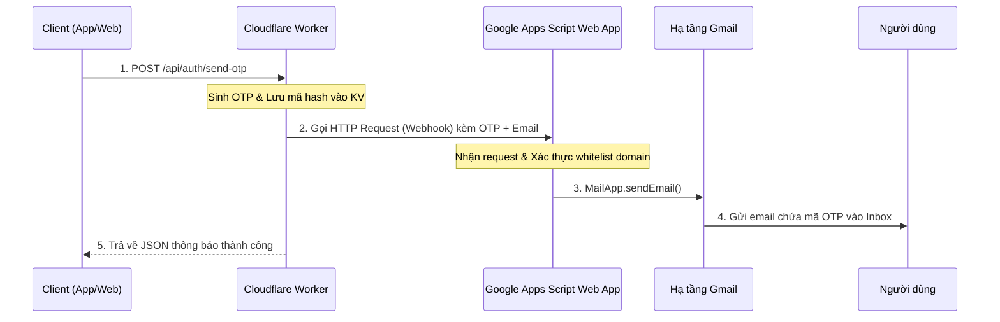

# Chuyên Đề 5: Webhooks & Google Apps Script (GAS) - Giải Pháp Gửi Email Hoàn Toàn Miễn Phí

Để hoàn thành quy trình xác thực email, hệ thống phải thực sự gửi được một lá thư chứa mã OTP đến hòm thư của người dùng. 

Thông thường, lập trình viên sẽ nghĩ đến việc mua một dịch vụ gửi email chuyên nghiệp như **SendGrid**, **Mailgun**, **Amazon SES**, hoặc tự dựng một **SMTP Server** riêng. Tuy nhiên, các giải pháp này hoặc là đắt đỏ, hoặc là quá phức tạp để cài đặt cấu hình các bản ghi DNS (SPF, DKIM, DMARC) để thư không bị rơi vào hòm thư rác (Spam).

Dự án này sử dụng một kiến trúc thông minh: **Kết hợp giữa Cloudflare Worker và Google Apps Script thông qua cơ chế Webhook.**

---

## 1. Webhook là gì?

> [!NOTE]  
> **Webhook** là một cơ chế cho phép một hệ thống (ở đây là Cloudflare Worker) tự động gửi dữ liệu thời gian thực tới một hệ thống khác (ở đây là Google Apps Script Web App) ngay lập tức khi một sự kiện xảy ra dưới dạng một yêu cầu HTTP (thường là POST hoặc GET).

Nói một cách dễ hiểu: Webhook giống như một chiếc chuông cửa tự động. Khi có sự kiện (sinh ra mã OTP thành công), Worker sẽ bấm chuông (gọi HTTP request tới URL của GAS) để thông báo cho GAS biết: *"Hãy gửi thư này cho email vyquochuy@gmail.com với nội dung OTP là 123456 nhé!"*.

---

## 2. Google Apps Script (GAS) là gì?

**Google Apps Script (GAS)** là nền tảng lập trình chạy trên môi trường điện toán đám mây của Google. Nó cho phép bạn viết mã JavaScript để tự động hóa các tác vụ và liên kết các sản phẩm của Google như Sheets, Gmail, Docs, Drive...

### Tại sao lại dùng GAS để gửi Email?
1. **Hoàn toàn miễn phí:** Bạn không tốn một đồng nào cả. Google cấp cho mỗi tài khoản cá nhân miễn phí hạn mức gửi tới **100 email mỗi ngày** (tài khoản Workspace cao cấp lên tới 1500 email/ngày).
2. **Độ tin cậy cực cao:** Email được gửi đi trực tiếp từ hạ tầng máy chủ của Google thông qua tài khoản Gmail cá nhân của bạn. Nhờ vậy, thư gửi đi **gần như 100% sẽ rơi vào hòm thư đến (Inbox)** chứ không bao giờ bị nhận diện là Spam.
3. **Cực kỳ nhanh và đơn giản:** Chỉ với 1 dòng code, Google tự lo liệu toàn bộ giao thức gửi thư.

---

## 3. Kiến trúc luồng hoạt động trong dự án

Dưới đây là chuỗi quy trình khép kín khi người dùng yêu cầu gửi mã OTP:



---

## 4. Phân tích mã nguồn Webhook trong dự án

### Phía Cloudflare Worker (`backend-cloudflare/src/index.ts`):
Worker thực hiện gọi fetch API tới Web App URL của Google Apps Script:

```typescript
const gasUrl = c.env.GAS_WEBHOOK_URL
if (gasUrl) {
  // Gửi request POST tới Webhook của GAS chứa thông tin Email và OTP dạng thô để gửi thư
  const response = await fetch(gasUrl, {
    method: 'POST',
    headers: { 'Content-Type': 'application/json' },
    body: JSON.stringify({ email, otp: otpCode }),
  })
}
```

### Phía Google Apps Script Web App:
Để nhận dữ liệu này từ Worker, trong Apps Script chúng ta viết hàm `doPost(e)` hoặc `doGet(e)` để hứng dữ liệu:

```javascript
function doPost(e) {
  try {
    // 1. Phân tích dữ liệu JSON do Worker gửi sang
    const data = JSON.parse(e.postData.contents);
    const to = data.email;
    const otp = data.otp;
    
    // 2. Định nghĩa nội dung email
    const subject = "Mã Xác Thực OTP Aero Verify";
    const body = "Mã OTP của bạn là: " + otp + ". Mã này sẽ hết hạn trong 5 phút. Vui lòng không chia sẻ mã này cho bất kỳ ai.";
    
    // 3. Sử dụng API Gmail của Google để gửi thư thực tế
    MailApp.sendEmail(to, subject, body);
    
    // Trả về phản hồi thành công cho Cloudflare Worker
    return ContentService.createTextOutput(JSON.stringify({ success: true }))
                         .setMimeType(ContentService.MimeType.JSON);
  } catch(error) {
    return ContentService.createTextOutput(JSON.stringify({ success: false, error: error.toString() }))
                         .setMimeType(ContentService.MimeType.JSON);
  }
}
```

### 🔒 Cơ chế bảo mật Whitelist Domain
Trong đoạn mã mẫu Apps Script ở README, ta thấy có cơ chế Whitelist:
```javascript
const WHITELIST = ['example.com', 'gmail.com'];
// ...
const emailDomain = to.split('@')[1];
if (!WHITELIST.includes(emailDomain)) {
  // Từ chối gửi nếu tên miền email không được phép nhằm tránh việc người lạ lạm dụng tài khoản gửi spam
}
```
Điều này vô cùng quan trọng giúp ngăn chặn kẻ xấu phát hiện ra URL Web App của bạn và gửi email nặc danh đến người khác.

---

## 📚 Tóm tắt bài học
* **Webhook** là cầu nối liên lạc thời gian thực giữa Cloudflare Worker và Google Apps Script thông qua giao thức HTTP.
* **Google Apps Script** là giải pháp tối ưu cho dự án vừa và nhỏ nhờ tính năng gửi email miễn phí, uy tín cao từ máy chủ Google.
* Tích hợp cơ chế bảo mật (như Whitelist domain, Token xác thực) trong mã nguồn GAS là bắt buộc để tự bảo vệ tài nguyên hòm thư của bạn.
