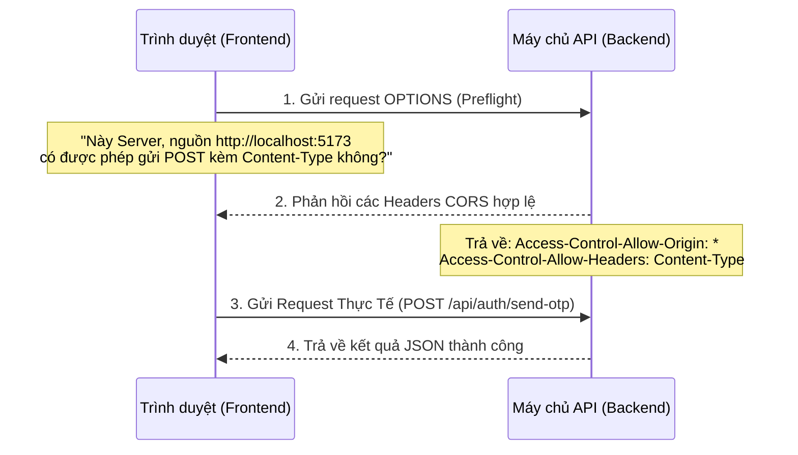

# Chuyên Đề 6: CORS (Cross-Origin Resource Sharing) - Bản Chất Của Lỗi Bị Chặn Gọi API Trên Trình Duyệt

Khi làm việc với các ứng dụng Client-Server (ví dụ: Frontend viết bằng React/Vue/Vite chạy ở cổng `5173`, gọi API tới Backend Node.js/Cloudflare Worker ở cổng `8787`), hầu như lập trình viên nào cũng từng gặp lỗi màu đỏ đáng sợ này trong tab Console của trình duyệt:

> *“Access to fetch at 'http://localhost:8787/api/auth/send-otp' from origin 'http://localhost:5173' has been blocked by CORS policy...”*

Vậy **CORS** là gì? Tại sao trình duyệt lại chặn chúng ta và cách khắc phục triệt để như thế nào? Hãy cùng tìm hiểu.

---

## 1. Nguồn gốc: Chính sách đồng nguồn (Same-Origin Policy - SOP)

CORS sinh ra để giải quyết một cơ chế bảo mật cực kỳ cơ bản của trình duyệt web: **Same-Origin Policy (Chính sách đồng nguồn)**.

### Định nghĩa "Origin" (Nguồn)
Một Nguồn được định nghĩa bằng bộ 3 bao gồm: **Giao thức (Protocol) + Tên miền (Domain) + Cổng kết nối (Port)**.

| URL A | URL B | Cùng Nguồn hay Khác Nguồn? | Giải thích lý do |
|---|---|---|---|
| `http://localhost:5173/` | `http://localhost:5173/login` | **Cùng Nguồn** | Trùng Protocol (http), trùng Domain (localhost), trùng Port (5173). |
| `http://localhost:5173/` | `https://localhost:5173/` | **Khác Nguồn** | Khác Giao thức (http vs https). |
| `http://localhost:5173/` | `http://localhost:8787/` | **Khác Nguồn** | Khác Cổng kết nối (5173 vs 8787). Đây chính là trường hợp của dự án chúng ta! |
| `http://myweb.com/` | `http://api.myweb.com/` | **Khác Nguồn** | Khác Tên miền phụ (Subdomain `api.myweb.com` vs `myweb.com`). |

### Tại sao lại cần Chính sách đồng nguồn (SOP)?
Nếu không có SOP, kẻ xấu có thể tạo một trang web độc hại `http://web-doc-hai.com`. Khi bạn truy cập trang đó, nó có thể tự động chạy một đoạn mã JavaScript ngầm để thực hiện gửi yêu cầu rút tiền tại `http://ngan-hang-cua-ban.com/chuyen-tien` thông qua cookie trình duyệt của bạn đang lưu sẵn. 

SOP ngăn cấm việc mã JavaScript từ một Origin này (`web-doc-hai.com`) tự ý truy cập hoặc thao túng dữ liệu của một Origin khác (`ngan-hang-cua-ban.com`).

---

## 2. Giải pháp: CORS hoạt động như thế nào?

Mặc dù chính sách SOP rất an toàn, nhưng trong thế giới phát triển phần mềm ngày nay, việc tách biệt hoàn toàn Frontend (Origin A) và Backend (Origin B) là vô cùng phổ biến. Trình duyệt cần một cơ chế linh hoạt để cho phép "vượt rào" an toàn. Cơ chế đó chính là **CORS (Cross-Origin Resource Sharing - Chia sẻ tài nguyên giữa các nguồn khác nhau)**.

### Cơ chế hoạt động:
CORS hoạt động bằng cách cho phép máy chủ (Backend) khai báo với trình duyệt thông qua các **HTTP Headers** đặc biệt để trình duyệt biết nguồn nào được phép truy cập tài nguyên.



### Bước đệm Preflight Request (OPTIONS)
Đối với các request nhạy cảm (như gửi POST chứa dữ liệu JSON), trình duyệt sẽ tự động gửi trước một request siêu nhẹ với phương thức `OPTIONS` lên server trước khi gửi request thật.
- Request OPTIONS này gọi là **Preflight Request**.
- Nếu máy chủ phản hồi chấp thuận nguồn gọi API, trình duyệt mới gửi tiếp request POST thật sự của người dùng đi.
- Nếu máy chủ từ chối hoặc không phản hồi các header CORS, trình duyệt sẽ lập tức chặn đứng yêu cầu đó và báo lỗi đỏ ở Console.

---

## 3. Cách chúng ta xử lý lỗi CORS trong Hono Framework

Trong file `backend-cloudflare/src/index.ts`, để Backend Worker cho phép cả Client Web chạy local (`localhost:5173`) hay Client di động Flutter gọi API, chúng ta cấu hình middleware CORS vô cùng đơn giản:

```typescript
import { cors } from 'hono/cors'

// Áp dụng middleware CORS cho tất cả các đường dẫn ('*')
app.use('*', cors({
  origin: '*', // Cho phép TẤT CẢ các nguồn được gọi (vô cùng hữu ích khi phân phối API công khai hoặc phát triển local)
  allowMethods: ['POST', 'GET', 'OPTIONS'], // Cho phép các phương thức này hoạt động
  allowHeaders: ['Content-Type'], // Cho phép client gửi thêm header này (cần thiết khi gửi JSON)
}))
```

### Giải thích các HTTP Headers máy chủ trả về nhờ CORS Middleware:
- **`Access-Control-Allow-Origin`**: `*` (Nghĩa là bất cứ website nào cũng có thể gọi API này. Đối với các hệ thống nhạy cảm hơn, bạn có thể giới hạn chính xác tên miền như `https://my-frontend.com`).
- **`Access-Control-Allow-Methods`**: `POST, GET, OPTIONS` (Khai báo các phương thức HTTP hợp lệ được phép gọi từ xa).
- **`Access-Control-Allow-Headers`**: `Content-Type` (Cho phép client chỉ định dữ liệu truyền là JSON bằng việc gửi kèm `Content-Type: application/json`).

---

## 📚 Tóm tắt bài học
* **CORS** là cơ chế bảo mật của trình duyệt, được điều khiển bằng HTTP Headers trả về từ phía Máy chủ (Backend).
* **OPTIONS (Preflight)** là một bước đệm kiểm tra an toàn tự động của trình duyệt trước khi thực hiện các yêu cầu thay đổi dữ liệu (POST, PUT, DELETE).
* Phải luôn cấu hình đúng Middleware CORS trên Backend (đặc biệt là phương thức `OPTIONS` và các Header được phép) để ứng dụng Frontend có thể kết nối thông suốt.
