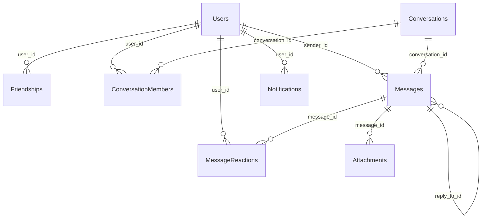
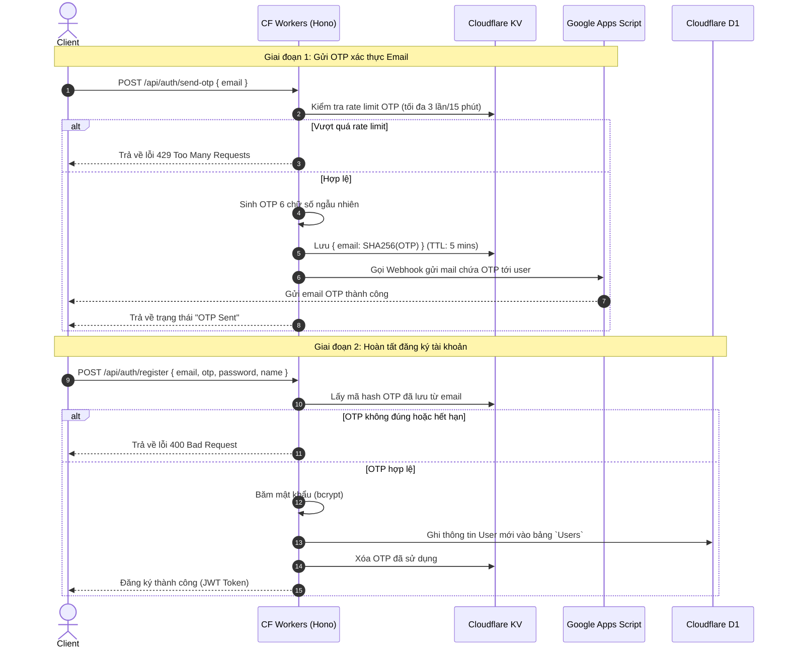
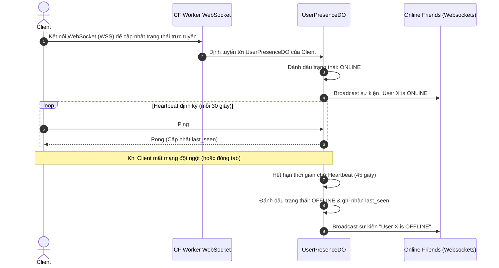
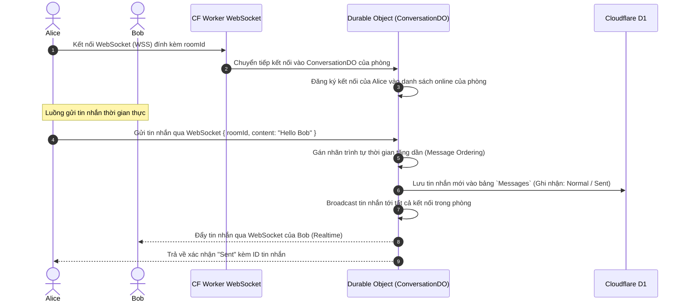
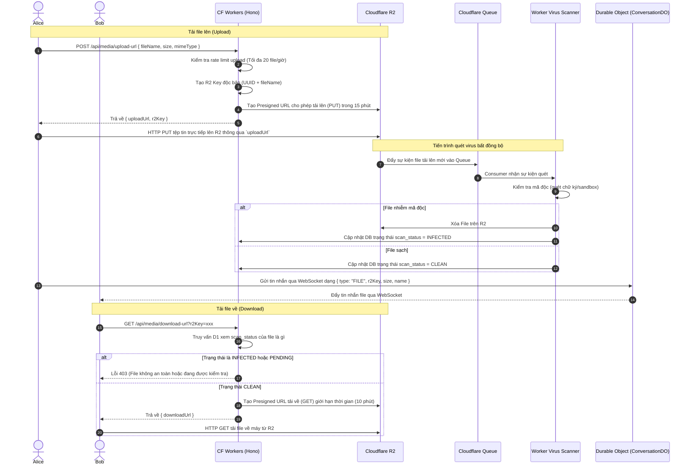
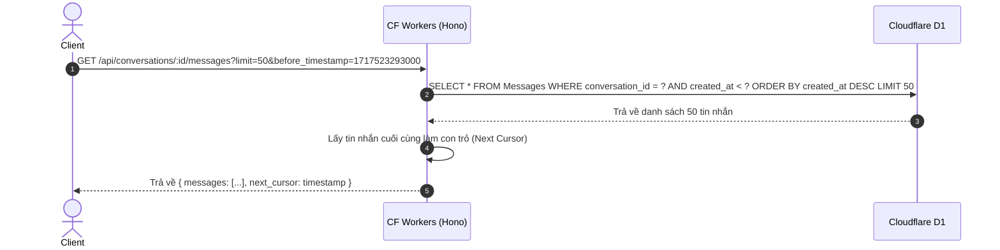

# Software Design Document (SDD): Cloudflare-Based Realtime Chat & File Sharing System (Revised)

Tài liệu này phác thảo kiến trúc hệ thống, mô hình dữ liệu, thiết kế API, sơ đồ hoạt động và kế hoạch triển khai cho ứng dụng Nhắn Tin & Chia Sẻ File Thời Gian Thực (tương tự Zalo/Telegram) hoạt động đa nền tảng (Responsive Web).

---

## 1. Mục tiêu dự án & Mô tả bài toán

### Mô tả bài toán
Nhu cầu liên lạc tức thời và chia sẻ tài liệu là một phần thiết yếu trong công việc và đời sống hàng ngày. Một hệ thống chat hiện đại đòi hỏi tốc độ truyền tải tin nhắn gần như tức thời (realtime), tính khả dụng cao, khả năng truyền tải và lưu trữ file dung lượng lớn và thiết kế giao diện linh hoạt. 

Hạ tầng truyền thống thường gặp khó khăn về chi phí duy trì máy chủ WebSocket, chi phí băng thông truyền tải file (egress fee) và tính mở rộng toàn cầu. 

Dự án này giải quyết bài toán trên bằng cách tận dụng **Edge Computing** của hệ sinh thái **Cloudflare**, giúp tối ưu hóa chi phí vận hành (gần như bằng 0 ở quy mô ban đầu), tăng tốc độ phản hồi toàn cầu và đảm bảo khả năng chịu tải tốt.

### Đối tượng sử dụng
*   **Người dùng cá nhân**: Kết nối, nhắn tin, gọi thoại, gửi file/ảnh cho bạn bè và gia đình.
*   **Doanh nghiệp / Nhóm làm việc**: Làm việc cộng tác qua các nhóm chat, chia sẻ tài liệu công việc với độ bảo mật cao.

### Các trường hợp sử dụng chính (Use Cases)
*   **Đăng ký và xác thực**: Đăng ký tài khoản bảo mật bằng Email OTP (đã có base trong repo) kết hợp mật khẩu truyền thống.
*   **Trò chuyện 1-1 & Trò chuyện nhóm**: Nhắn tin realtime với bạn bè hoặc tạo phòng chat nhóm để làm việc chung.
*   **Chia sẻ đa phương tiện**: Gửi ảnh trực tiếp, chia sẻ các tài liệu công việc (PDF, Word, Zip) dung lượng lớn.
*   **Trạng thái hoạt động**: Xem trạng thái online/offline của bạn bè và trạng thái "đang nhập tin nhắn" (typing indicator).

---

## 2. Phân tích yêu cầu

### 2.1. Yêu cầu chức năng (Functional Requirements)

| Nhóm chức năng | Mã | Yêu cầu chi tiết |
| :--- | :--- | :--- |
| **Xác thực** | FR-01 | Đăng ký tài khoản mới bằng Email + OTP + Mật khẩu. |
| | FR-02 | Đăng nhập / Đăng xuất an toàn bằng JWT. |
| | FR-03 | Quên mật khẩu: Xác thực qua Email OTP và reset mật khẩu mới. |
| | FR-04 | Tạo UID người dùng: 8 chữ số tăng dần từ 10000000. |
| **Tài khoản** | FR-05 | Quản lý hồ sơ cá nhân (thay avatar, tên hiển thị, trạng thái bio). |
| | FR-06 | Tìm kiếm người dùng bằng email hoặc số điện thoại (nếu có). |
| **Bạn bè** | FR-07 | Gửi lời mời kết bạn, đồng ý / từ chối kết bạn. |
| | FR-08 | Hiển thị danh sách bạn bè đang có. |
| | FR-09 | Chặn người dùng (không nhận tin nhắn từ người bị chặn). |
| **Trò chuyện** | FR-10 | Tạo cuộc trò chuyện cá nhân (1-1) tự động khi kết bạn/gửi tin nhắn. |
| | FR-11 | Tạo cuộc trò chuyện nhóm (Group Chat) với nhiều thành viên. |
| | FR-12 | Gửi tin nhắn văn bản thời gian thực. |
| | FR-13 | Thu hồi tin nhắn (xóa ở cả 2 phía) và chỉnh sửa tin nhắn đã gửi. |
| | FR-14 | Trạng thái tin nhắn: Đã gửi (Sent) -> Đã nhận (Delivered) -> Đã xem (Read). |
| | FR-15 | Trạng thái "đang nhập tin nhắn" (typing...) của đối phương. |
| | FR-16 | Tìm kiếm tin nhắn theo từ khóa trong hội thoại. |
| **Đa phương tiện**| FR-17 | Gửi hình ảnh trực tiếp (nén trước khi gửi, có chế độ preview). |
| | FR-18 | Gửi file đính kèm với thanh tiến trình tải lên (upload progress bar). |
| | FR-19 | Tải file đính kèm về thiết bị. |
| **Realtime** | FR-20 | Trạng thái Online/Offline của người dùng hiển thị tức thời. |
| | FR-21 | Nhận thông báo đẩy (Push/Toast Notification) khi có tin nhắn mới dù đang ở ngoài phòng chat. |
| | FR-22 | Thả cảm xúc tin nhắn (Message Reactions) với các biểu tượng 👍, ❤️, 😂, 😢. |
| **Quản trị nhóm**| FR-23 | Thêm/Xóa thành viên khỏi nhóm chat. |
| | FR-24 | Phân quyền nhóm: Chỉ định trưởng nhóm (Owner) và phó nhóm (Admin). |
| **Bảo mật & Báo cáo**| FR-25 | Báo cáo (Report) người dùng vi phạm điều khoản. |

### 2.2. Yêu cầu phi chức năng (Non-Functional Requirements)

*   **Hiệu năng (Performance)**:
    *   Độ trễ gửi/nhận tin nhắn (End-to-End latency) < 200ms.
    *   Tải trang tĩnh ban đầu < 1.5s nhờ CDN của Cloudflare Pages.
*   **Khả năng mở rộng (Scalability)**:
    *   Hệ thống có cấu trúc Serverless, tự động mở rộng theo lượng request mà không cần can thiệp hạ tầng.
*   **Bảo mật (Security)**:
    *   Mọi kết nối truyền tải dữ liệu bắt buộc qua HTTPS và WSS (Secure WebSockets).
    *   Mật khẩu người dùng được băm bằng thuật toán bảo mật (ví dụ: Argon2 hoặc bcrypt) trước khi lưu.
    *   File lưu trên R2 được kiểm soát quyền truy cập qua đường dẫn có thời hạn (Presigned URL) và quét virus tự động trước khi cho phép tải xuống.
    *   Áp dụng hệ thống giới hạn tần suất yêu cầu (Rate Limiting) ở mọi tầng.
*   **Khả năng chịu tải (High Concurrency)**:
    *   Xử lý đồng thời 10,000+ kết nối WebSocket hoạt động mà không bị gián đoạn.
*   **Độ sẵn sàng (Availability)**:
    *   Đạt SLA 99.9% nhờ hạ tầng phân tán toàn cầu của Cloudflare.
*   **Logging & Monitoring**:
    *   Tích hợp log qua Cloudflare Workers Analytics Engine hoặc xuất log ra các bên thứ 3 (như Axiom, Datadog) khi cần.
*   **Backup dữ liệu (Backup)**:
    *   Hệ thống cơ sở dữ liệu Cloudflare D1 hỗ trợ cơ chế tự động backup định kỳ hàng ngày.
*   **Trải nghiệm người dùng (UX/UI)**:
    *   Giao diện responsive mượt mà trên cả máy tính (Desktop) và điện thoại di động (Mobile).
    *   Tránh hiện tượng nháy màn hình (Flickering), hỗ trợ chế độ tối (Dark Mode) chuẩn Premium.

---

## 3. Kiến trúc hệ thống

### 3.1. Mô hình tổng thể (System Architecture)

```
                       +---------------------------------------+
                       |          Web App (React/Vite)         |
                       |       (Hosted on Cloudflare Pages)    |
                       +---------------------------------------+
                            /                           \
               HTTPS requests (REST API)             WSS Connection
                          /                               \
                         v                                 v
        +-----------------------------------+    +---------------------------------------+
        |        Cloudflare Worker          |    |          Cloudflare Worker            |
        |         (API Endpoint)            |    |       (WebSocket Gatekeeper)          |
        +-----------------------------------+    +---------------------------------------+
             /           |             \             |                              |
            /            |              \            v                              v
           v             v               v       +-------------------+        +--------------------+
  +-------------+  +------------+  +-----------+ |   ConversationDO  |        |   UserPresenceDO   |
  |  Cloudflare |  | Cloudflare |  |Cloudflare | | (Typing, Room WS, |        | (Global Online/Off,|
  |     KV      |  |     D1     |  |    R2     | |  Read Receipt,    |        |    Last Seen)      |
  | (Session/   |  | (Relation  |  |  (File/   | |  Msg Ordering)    |        +--------------------+
  |  RateLimit) |  | Database)  |  |  Storage) | +-------------------+
  +-------------+  +------------+  +-----------+          |
                                                          v
                                                 (D1 Sync / Batching)
```

### 3.2. Chi tiết phân hệ Durable Objects (DO)
Để tối ưu khả năng chịu tải và phân tách mối quan tâm (Separation of Concerns), hệ thống chia làm 2 loại Durable Objects:

1.  **`ConversationDO` (Quản lý Hội thoại)**:
    *   Mỗi phòng chat (hội thoại 1-1 hoặc hội thoại nhóm) tương ứng với một thực thể `ConversationDO` duy nhất.
    *   **Nhiệm vụ**: Duy trì kết nối WebSocket của các thành viên đang ở trong phòng chat đó, điều phối trạng thái nhập văn bản (`typing`), xử lý biên nhận đã đọc (`read receipt`), đảm bảo thứ tự tin nhắn gửi lên (`message ordering`) và đồng bộ hóa tin nhắn tức thời.
2.  **`UserPresenceDO` (Quản lý Trạng thái Trực tuyến)**:
    *   Mỗi người dùng trực tuyến tương ứng với một thực thể `UserPresenceDO`.
    *   **Nhiệm vụ**: Theo dõi trạng thái trực tuyến thời gian thực (`online`/`offline`), duy trì heartbeat từ client để phát hiện mất kết nối đột ngột, lưu trữ thời gian tương tác cuối (`last seen`) và lập tức thông báo trạng thái này cho danh sách bạn bè của người dùng mà không bị trễ như cơ chế eventual consistency của Cloudflare KV.

---

## 4. Công nghệ sử dụng

### 4.1. Frontend
*   **React**: Thư viện UI phổ biến nhất giúp quản lý giao diện dạng component-based. Khả năng đồng bộ UI với state tốt giúp xử lý các sự kiện tin nhắn đến liên tục dễ dàng hơn.
*   **TypeScript**: Đảm bảo type-safe giữa Frontend và Backend (chia sẻ Types thông qua monorepo), hạn chế các lỗi runtime ngớ ngẩn liên quan đến null/undefined dữ liệu tin nhắn.
*   **TailwindCSS**: Giúp lập trình viên viết giao diện nhanh, tùy biến cao và hỗ trợ Responsive Design cực kỳ đơn giản qua các class prefix như `md:`, `lg:`.

### 4.2. Backend
*   **Hono**: Framework RESTful cực nhanh, tối ưu hóa tuyệt đối cho Cloudflare Workers với dung lượng bundle cực kỳ nhỏ gọn.
*   **Cloudflare Workers**: Giải pháp chạy code không máy chủ (Serverless), phân phối tới hơn 300+ Edge Location của Cloudflare giúp phản hồi các request API gần như ngay lập tức.

### 4.3. Database & Storage
*   **Cloudflare D1**: Cơ sở dữ liệu SQL nằm sát cạnh Cloudflare Worker, giúp tối ưu hóa độ trễ truy vấn dữ liệu quan hệ (Join bảng giữa Users, Friends, Messages).
*   **Cloudflare R2**: Nơi lưu trữ lý tưởng cho hệ thống chat. Do hệ thống chat thường xuyên đọc/ghi hình ảnh và file đính kèm, việc R2 không tính phí băng thông tải về (Zero Egress Fee) giúp tiết kiệm đến 90% chi phí vận hành so với AWS S3.
*   **Cloudflare KV**: Tốc độ đọc rất nhanh (vài mili-giây) toàn cầu. Phù hợp lưu trữ dữ liệu dạng cache ít ghi nhưng đọc nhiều (như Token đen, Cấu hình hệ thống, OTP gửi qua Email) và phối hợp triển khai giải pháp giới hạn tần suất (Rate Limiting).

### 4.4. Realtime Technology
*   **Durable Objects**: Cung cấp khả năng lưu trữ trạng thái (stateful) và thực thi code đơn luồng (single-threaded execution) cho từng thực thể. Giúp giải quyết bài toán đồng bộ hóa trạng thái WebSocket của phòng chat và trạng thái Online/Offline mà không cần cơ sở dữ liệu bên thứ 3 (như Redis).
*   **WebSockets**: Công nghệ giao thức kết nối 2 chiều liên tục giữa Client và Server, giúp truyền tải tin nhắn tức thì.

---

## 5. Thiết kế cơ sở dữ liệu (Database Schema)

Cơ sở dữ liệu lưu trữ tại **Cloudflare D1** (SQLite). Dưới đây là thiết kế chi tiết cho các bảng:



### 5.1. Bảng `Users`
Lưu trữ thông tin người dùng.

| Tên cột | Kiểu dữ liệu | Thuộc tính | Mô tả |
| :--- | :--- | :--- | :--- |
| `id` | TEXT (UUID) | PRIMARY KEY | Khóa chính của người dùng |
| `email` | TEXT | UNIQUE, NOT NULL | Địa chỉ email đăng ký |
| `password_hash` | TEXT | NOT NULL | Mật khẩu đã được hash bằng bcrypt |
| `display_name` | TEXT | NOT NULL | Tên hiển thị của người dùng |
| `uid` | INTEGER | UNIQUE, NOT NULL | UID công khai từ 10000000 đến 99999999 |
| `avatar_url` | TEXT | NULL | URL ảnh đại diện trên Cloudflare R2 |
| `bio` | TEXT | NULL | Trạng thái hiển thị cá nhân |
| `created_at` | INTEGER | NOT NULL | Thời gian tạo (Epoch Milliseconds) |
| `updated_at` | INTEGER | NOT NULL | Thời gian cập nhật cuối |

### 5.2. Bảng `Friendships`
Lưu trữ trạng thái mối quan hệ bạn bè giữa các người dùng.

| Tên cột | Kiểu dữ liệu | Thuộc tính | Mô tả |
| :--- | :--- | :--- | :--- |
| `id` | TEXT (UUID) | PRIMARY KEY | Khóa chính |
| `user_id_1` | TEXT (UUID) | FOREIGN KEY (Users) | Người gửi lời mời kết bạn |
| `user_id_2` | TEXT (UUID) | FOREIGN KEY (Users) | Người nhận lời mời kết bạn |
| `status` | TEXT | NOT NULL | Trạng thái: `PENDING`, `ACCEPTED`, `BLOCKED` |
| `created_at` | INTEGER | NOT NULL | Thời gian tạo mối quan hệ |
| `updated_at` | INTEGER | NOT NULL | Thời gian cập nhật trạng thái |

### 5.3. Bảng `Conversations`
Lưu trữ các phòng chat (cá nhân và nhóm).

| Tên cột | Kiểu dữ liệu | Thuộc tính | Mô tả |
| :--- | :--- | :--- | :--- |
| `id` | TEXT (UUID) | PRIMARY KEY | Khóa chính |
| `name` | TEXT | NULL | Tên nhóm (NULL đối với chat 1-1) |
| `type` | TEXT | NOT NULL | Loại trò chuyện: `DIRECT`, `GROUP` |
| `avatar_url` | TEXT | NULL | Ảnh đại diện của nhóm chat |
| `created_at` | INTEGER | NOT NULL | Thời gian tạo cuộc trò chuyện |
| `updated_at` | INTEGER | NOT NULL | Lần cập nhật tin nhắn cuối cùng |

### 5.4. Bảng `ConversationMembers`
Bảng trung gian quản lý thành viên trong từng cuộc trò chuyện.

| Tên cột | Kiểu dữ liệu | Thuộc tính | Mô tả |
| :--- | :--- | :--- | :--- |
| `conversation_id` | TEXT (UUID) | FOREIGN KEY (Conversations) | Tham chiếu đến cuộc trò chuyện |
| `user_id` | TEXT (UUID) | FOREIGN KEY (Users) | Tham chiếu đến người dùng |
| `role` | TEXT | NOT NULL | Vai trò: `OWNER`, `ADMIN`, `MEMBER` |
| `joined_at` | INTEGER | NOT NULL | Thời gian tham gia phòng |
| `last_read_message_id`| TEXT (UUID) | NULL | ID của tin nhắn cuối cùng đã đọc |
| PRIMARY KEY | (`conversation_id`, `user_id`) | | Khóa chính tổng hợp |

### 5.5. Bảng `Messages`
Lưu trữ lịch sử tin nhắn.

| Tên cột | Kiểu dữ liệu | Thuộc tính | Mô tả |
| :--- | :--- | :--- | :--- |
| `id` | TEXT (UUID) | PRIMARY KEY | Khóa chính của tin nhắn |
| `conversation_id` | TEXT (UUID) | FOREIGN KEY (Conversations) | Tin nhắn thuộc cuộc trò chuyện nào |
| `sender_id` | TEXT (UUID) | FOREIGN KEY (Users) | Người gửi tin nhắn |
| `content` | TEXT | NULL | Nội dung tin nhắn (NULL nếu chỉ gửi file) |
| `type` | TEXT | NOT NULL | Loại tin nhắn: `TEXT`, `FILE`, `IMAGE`, `SYSTEM` |
| `message_state` | TEXT | NOT NULL | Trạng thái nội dung: `NORMAL`, `EDITED`, `RECALLED` |
| `delivery_state` | TEXT | NOT NULL | Trạng thái nhận: `SENT`, `DELIVERED`, `READ` |
| `reply_to_id` | TEXT (UUID) | FOREIGN KEY (Messages) | Trả lời cho tin nhắn khác (nếu có) |
| `created_at` | INTEGER | NOT NULL | Thời điểm gửi (Epoch Milliseconds) |
| `updated_at` | INTEGER | NOT NULL | Thời điểm cập nhật cuối (nếu sửa) |

### 5.6. Bảng `MessageReactions`
Lưu trữ cảm xúc tương tác trên từng tin nhắn.

| Tên cột | Kiểu dữ liệu | Thuộc tính | Mô tả |
| :--- | :--- | :--- | :--- |
| `id` | TEXT (UUID) | PRIMARY KEY | Khóa chính |
| `message_id` | TEXT (UUID) | FOREIGN KEY (Messages) | Tin nhắn được thả cảm xúc |
| `user_id` | TEXT (UUID) | FOREIGN KEY (Users) | Người dùng thả cảm xúc |
| `reaction` | TEXT | NOT NULL | Loại cảm xúc: `LIKE`, `LOVE`, `LAUGH`, `SAD` (👍, ❤️, 😂, 😢) |
| `created_at` | INTEGER | NOT NULL | Thời gian tạo cảm xúc |
| UNIQUE INDEX | (`message_id`, `user_id`) | | Ràng buộc: Mỗi người chỉ được thả 1 reaction trên 1 tin nhắn |

### 5.7. Bảng `Attachments`
Lưu trữ các tệp đính kèm đi kèm với tin nhắn.

| Tên cột | Kiểu dữ liệu | Thuộc tính | Mô tả |
| :--- | :--- | :--- | :--- |
| `id` | TEXT (UUID) | PRIMARY KEY | Khóa chính |
| `message_id` | TEXT (UUID) | FOREIGN KEY (Messages) | Thuộc về tin nhắn nào |
| `file_name` | TEXT | NOT NULL | Tên tệp tin gốc |
| `file_size` | INTEGER | NOT NULL | Kích thước tệp tin (bytes) |
| `mime_type` | TEXT | NOT NULL | Định dạng tệp tin (ví dụ: `image/png`, `application/pdf`) |
| `r2_key` | TEXT | NOT NULL | Đường dẫn (Key) lưu trữ trên Cloudflare R2 |
| `scan_status` | TEXT | NOT NULL | Trạng thái quét virus: `PENDING`, `CLEAN`, `INFECTED` |
| `created_at` | INTEGER | NOT NULL | Thời gian tải lên |

### 5.8. Bảng `Notifications`
Lưu trữ các thông báo hệ thống hoặc tin nhắn chờ của người dùng.

| Tên cột | Kiểu dữ liệu | Thuộc tính | Mô tả |
| :--- | :--- | :--- | :--- |
| `id` | TEXT (UUID) | PRIMARY KEY | Khóa chính |
| `user_id` | TEXT (UUID) | FOREIGN KEY (Users) | Người nhận thông báo |
| `title` | TEXT | NOT NULL | Tiêu đề thông báo |
| `body` | TEXT | NOT NULL | Nội dung hiển thị |
| `is_read` | INTEGER (0 hoặc 1) | DEFAULT 0 | Trạng thái đã đọc |
| `type` | TEXT | NOT NULL | Loại thông báo: `FRIEND_REQUEST`, `SYSTEM` |
| `created_at` | INTEGER | NOT NULL | Thời gian tạo thông báo |

---

## 6. Luồng hoạt động (Sequence Diagrams)

### 6.1. Luồng Đăng ký & Đăng nhập bằng OTP + Mật khẩu


### 6.2. Luồng Trực tuyến và Heartbeat qua UserPresenceDO


### 6.3. Luồng Gửi tin nhắn và Phát realtime qua ConversationDO


### 6.4. Luồng Gửi, Quét Virus và Tải File thông qua R2 & Queue


### 6.5. Luồng Đồng bộ lịch sử tin nhắn (Pagination)


---

## 7. Thiết kế API (RESTful & WebSocket)

Mọi API đều có base URL `/api` và bắt buộc đính kèm header `Authorization: Bearer <JWT_TOKEN>` (trừ các API auth công khai).

### 7.1. Authentication APIs

*   **POST `/api/auth/send-otp`**: Gửi mã OTP xác thực email. (Giới hạn: 3 lần/15 phút)
    *   *Request Body:* `{"email": "string"}`
    *   *Response (200):* `{"message": "OTP sent successfully"}`
*   **POST `/api/auth/register`**: Tạo tài khoản mới.
    *   *Request Body:* `{"email": "string", "otp": "string", "password_hash": "string", "display_name": "string"}`
    *   *Response (201):* `{"token": "JWT_TOKEN", "user": { "id": "uuid", "email": "string" }}`
*   **POST `/api/auth/login`**: Đăng nhập. (Giới hạn: 5 lần/phút)
    *   *Request Body:* `{"email": "string", "password_hash": "string"}`
    *   *Response (200):* `{"token": "JWT_TOKEN"}`

### 7.2. Friends APIs

*   **GET `/api/friends`**: Danh sách bạn bè.
    *   *Response (200):* `[{"id": "uuid", "display_name": "string", "avatar_url": "string", "status": "ACCEPTED"}]`
*   **POST `/api/friends/request`**: Gửi lời mời kết bạn.
    *   *Request Body:* `{"target_user_id": "string"}`
    *   *Response (200):* `{"message": "Friend request sent"}`
*   **POST `/api/friends/respond`**: Trả lời lời mời kết bạn.
    *   *Request Body:* `{"request_id": "string", "action": "ACCEPT | DECLINE"}`
    *   *Response (200):* `{"message": "Action updated successfully"}`

### 7.3. Conversation & Message APIs

*   **GET `/api/conversations`**: Lấy danh sách các cuộc hội thoại gần đây.
*   **GET `/api/conversations/:id/messages`**: Đồng bộ lịch sử tin nhắn sử dụng Cursor Pagination dựa trên thời gian tạo.
    *   *Query Params:* `?limit=50&before_timestamp=1717523293000`
    *   *Response (200):*
        ```json
        {
          "messages": [
            {
              "id": "msg-uuid-1",
              "sender_id": "user-uuid-1",
              "content": "Chào bạn!",
              "type": "TEXT",
              "message_state": "NORMAL",
              "delivery_state": "READ",
              "created_at": 1717523292000,
              "reactions": [
                { "user_id": "user-uuid-2", "reaction": "LIKE" }
              ]
            }
          ],
          "next_cursor": 1717523292000
        }
        ```

### 7.4. Media Transfer APIs

*   **POST `/api/media/upload-url`**: Yêu cầu Presigned URL để upload file lên R2. (Giới hạn: 20 file/giờ)
    *   *Request Body:* `{"file_name": "string", "file_size": 10240, "mime_type": "application/pdf"}`
    *   *Response (200):* `{"upload_url": "https://r2.domain.com/...", "r2_key": "uuid-filename"}`

---

## 8. Thiết kế giao diện (UI Wireframe)

Giao diện áp dụng Responsive Grid Layout:
*   **Desktop**: Hiển thị dạng 2 cột hoặc 3 cột (Danh sách Chat bên trái - Khung Chat ở giữa - Thông tin chi tiết bên phải).
*   **Mobile**: Hiển thị 1 cột (Danh sách Chat, bấm vào chat mới đẩy màn hình Khung Chat lên đè - Stack Navigator).

### 8.1. Wireframe Desktop (Hội thoại chính)
```
+-----------------------------------------------------------------------------------------+
| [Logo] VivyChat  | Tìm kiếm bạn bè...   [Q]    |  [Avatar] Alice (Online)           [i] |
+-------------------------------------------------+---------------------------------------+
|  [Hộp thoại]     |  Alice: "Tập tin tài liệu nè!"| Alice: Cho tớ xin tài liệu dự án nhé  |
|                  |  16:15                        | 16:10                                 |
|  [Danh bạ]       +------------------------------+---------------------------------------+
|                  |  Bob (16:11):                | Bạn đã gửi một tệp tin:               |
|  [Cài đặt]       |  "Đã gửi qua R2 rồi nhé"     | [FileIcon] Kehoach.pdf (2.4MB)        |
|                  |                              | [Tải xuống v] [Quét: Sạch]            |
|                  |                              | [👍 2] [❤️ 1]                           |
|                  +------------------------------+---------------------------------------+
|                  |  Alice đang nhập...          |                                       |
|                  +------------------------------+---------------------------------------+
|                  | [ + ] Nhập tin nhắn ở đây...                           [ Gửi ]       |
+-----------------------------------------------------------------------------------------+
```

---

## 9. Kế hoạch triển khai theo từng giai đoạn

### Phase 1: Xác thực người dùng (Authentication)

* **Mục tiêu**: Xây dựng hệ thống đăng ký, xác thực đăng nhập bằng JWT và bảo mật OTP qua Email. Tích hợp Rate Limiting cho luồng Auth để chống Brute-force.
* **Thời gian dự kiến**: Tuần 1.
* **Deliverables**:
* Database schema trong Cloudflare D1 cho bảng `Users`.
* Hono API xác thực và cơ chế Rate Limiting sử dụng Cloudflare KV.
* Màn hình đăng nhập/đăng ký ở Frontend React.


### Phase 2: Hệ thống bạn bè & Tìm kiếm (Friend System)

* **Mục tiêu**: Người dùng có thể tìm thấy nhau qua email/tên và gửi yêu cầu kết bạn.
* **Thời gian dự kiến**: Tuần 2.
* **Deliverables**:
* Database schema trong D1 cho `Friendships` và `Notifications`.
* API thực hiện các thao tác: gửi yêu cầu kết bạn, đồng ý kết bạn, lấy danh sách bạn bè.
* Giao diện tìm kiếm người dùng và danh bạ trên Frontend.


### Phase 3: Xây dựng giao diện chat cơ bản (Basic Chat Interface)

* **Mục tiêu**: Xây dựng giao diện khung chat nền tảng web với kiến trúc Component rõ ràng và thiết kế Responsive.
* **Thời gian dự kiến**: Tuần 3.
* **Deliverables**:
* Cấu trúc các React Components chính: Sidebar (danh sách bạn bè/phòng chat), MessageList (khu vực hiển thị tin nhắn), MessageInput (khung nhập liệu).
* Tích hợp State Management (Zustand hoặc Redux) để quản lý luồng dữ liệu tin nhắn phức tạp ở Client.
* Giao diện hoàn thiện sử dụng CSS Framework (như TailwindCSS), đảm bảo hiển thị tốt trên cả Desktop và Mobile.


### Phase 4: Hệ thống Chat cốt lõi & Durable Objects (Core Chat System)

* **Mục tiêu**: Thiết lập WebSocket để gửi/nhận tin nhắn thời gian thực. Cấu hình phân tách `ConversationDO` và `UserPresenceDO`, đồng thời giải quyết bài toán hiệu suất ghi dữ liệu.
* **Thời gian dự kiến**: Tuần 4-5.
* **Deliverables**:
* Cloudflare Durable Objects: `ConversationDO` (quản lý phòng chat) và `UserPresenceDO` (quản lý trạng thái online).
* **Cơ chế Write-behind Cache**: `ConversationDO` gộp các tin nhắn mới trên RAM và thực hiện Batch Insert (ghi gộp) vào D1 định kỳ thay vì ghi từng dòng để tránh thắt cổ chai hiệu suất.
* **Cơ chế tự động kết nối lại (Exponential Backoff)**: Client tự động kết nối lại khi rớt mạng và gửi kèm ID tin nhắn cuối cùng để đồng bộ phần dữ liệu bị lỡ.
* API phân trang tin nhắn (Cursor Pagination) sử dụng thời gian tạo.


### Phase 5: Chia sẻ tệp đa phương tiện & Quét mã độc (File Sharing & Security)

* **Mục tiêu**: Người dùng tải lên hình ảnh/tệp qua Cloudflare R2 an toàn, không làm quá tải Server, kết hợp quét virus tự động.
* **Thời gian dự kiến**: Tuần 5.
* **Deliverables**:
* Cloudflare R2 Bucket được cấu hình CORS.
* Hệ thống cấp quyền Presigned URL từ Hono API để Client tự tải file trực tiếp lên R2.
* Cloudflare Queue tích hợp Workers Virus Scanner để quét mã độc bất đồng bộ (Asynchronous) ngay khi file được tải lên thành công.


### Phase 6: Realtime nâng cao & Mã hóa đầu cuối (Advanced Realtime & End-to-End Encryption)

* **Mục tiêu**: Nâng cao trải nghiệm thời gian thực của hệ thống chat và triển khai cơ chế Mã hóa đầu cuối (End-to-End Encryption - E2EE) để đảm bảo chỉ người gửi và người nhận mới có thể đọc được nội dung tin nhắn.

* **Thời gian dự kiến**: Tuần 6.

* **Deliverables**:

#### Realtime Experience

* Triển khai trạng thái **Đang nhập tin nhắn (Typing Indicator)** thông qua WebSocket.
* Hiển thị **Toast Notification** khi nhận tin nhắn mới từ cuộc trò chuyện khác đang không được mở.
* Tối ưu đồng bộ trạng thái realtime giữa các client đang kết nối cùng một cuộc hội thoại.

#### End-to-End Encryption (E2EE)

* Tích hợp **Web Crypto API** tại Frontend.
* Mỗi người dùng sở hữu một cặp khóa mật mã riêng:

  * Public Key được lưu trên máy chủ để phục vụ trao đổi khóa.
  * Private Key được mã hóa bằng Recovery Password trước khi sao lưu lên hệ thống.
* Tin nhắn được mã hóa tại Client trước khi gửi qua WebSocket.
* Durable Objects, D1 Database và Backend API chỉ xử lý và lưu trữ dữ liệu ở dạng Ciphertext.
* Máy chủ không có khả năng giải mã nội dung tin nhắn của người dùng.

#### Device Recovery & Key Management

* Hỗ trợ khôi phục khóa mã hóa trên thiết bị mới bằng Recovery Password.
* Private Key được sao lưu dưới dạng mã hóa và chỉ có thể giải mã tại Client.
* Nếu người dùng quên Recovery Password:

  * Có thể tạo cặp khóa mới (Key Rotation / Reset Encryption).
  * Tiếp tục gửi và nhận tin nhắn mới bình thường.
  * Mất khả năng giải mã các tin nhắn được mã hóa bằng khóa cũ.

#### Security Verification

* Xác minh toàn bộ tin nhắn trong D1 chỉ tồn tại dưới dạng Ciphertext.
* Kiểm tra luồng khôi phục thiết bị mới bằng Recovery Password.
* Kiểm tra luồng Reset Encryption và xoay vòng khóa.
* Đảm bảo máy chủ không thể đọc được nội dung tin nhắn trong bất kỳ trường hợp nào.


### Phase 7: Hoàn thiện, Tối ưu & Đóng gói (Refinement & Deployment)

* **Mục tiêu**: Hoàn thiện các tính năng phụ trợ của tin nhắn, tối ưu hóa code và đưa ứng dụng lên môi trường thực tế.
* **Thời gian dự kiến**: Tuần 7.
* **Deliverables**:
* API và logic xử lý thu hồi (recall) và chỉnh sửa (edit) tin nhắn, đảm bảo đồng bộ trạng thái lập tức tới mọi Client đang trong phòng.
* Tối ưu hóa kích thước file tĩnh (Vite build optimization) và cấu hình bảo mật WSS.
* Triển khai thực tế toàn bộ Frontend lên Cloudflare Pages và Backend API/WebSockets lên Cloudflare Workers.

---

## 10. Phân tích các thách thức kỹ thuật trên Cloudflare

### 10.1. Giới hạn kết nối WebSocket của Cloudflare
*   *Vấn đề:* Cloudflare Workers miễn phí giới hạn thời gian chạy CPU và số lượng kết nối WebSocket đồng thời. Kế hoạch miễn phí có thể gặp lỗi nếu số kết nối cùng một lúc vượt ngưỡng.
*   *Giải pháp:*
    *   Tối ưu hóa tài nguyên CPU: chỉ gửi các sự kiện thực sự cần thiết qua WebSocket. Ví dụ: Sự kiện "Đang nhập tin nhắn" không ghi vào Database D1, chỉ broadcast tức thời trong bộ nhớ của Durable Object.

### 10.2. Chi phí Durable Objects (DO)
*   *Vấn đề:* Durable Objects tính phí dựa trên số lượng request ghi/đọc trạng thái và thời gian chạy. Nếu mỗi tin nhắn đều ghi trạng thái vào bộ lưu trữ của DO (Storage API), chi phí sẽ tăng lên rất nhanh.
*   *Giải pháp:*
    *   Dùng Durable Objects chủ yếu để duy trì các WebSocket connection trực tuyến và làm router trung chuyển (Pub/Sub).
    *   Lưu lịch sử tin nhắn trực tiếp xuống Cloudflare D1 (dạng lô lớn - Batching ghi) thay vì ghi liên tục vào bộ lưu trữ cục bộ của DO.

### 10.3. Đồng bộ hóa dữ liệu (Data Consistency)
*   *Vấn đề:* Cloudflare D1 là cơ sở dữ liệu phân tán ở biên toàn cầu. Việc cập nhật ghi dữ liệu từ nhiều khu vực địa lý khác nhau có thể gặp độ trễ đồng bộ (Read-after-Write consistency).
*   *Giải pháp:* 
    *   Thiết lập Durable Object làm nguồn dữ liệu đáng tin cậy duy nhất (Single Source of Truth) cho trạng thái hiện thời của phòng chat. Các thao tác ghi tin nhắn mới sẽ được định tuyến thông qua Durable Object trước khi đồng bộ xuống D1 để đảm bảo thứ tự thời gian của tin nhắn là chính xác tuyệt đối.

### 10.4. Tải lên tệp tin dung lượng lớn (Large File Uploads)
*   *Vấn đề:* Workers có giới hạn dung lượng request tối đa (100MB cho gói trả phí và 100MB cho payload truyền qua Worker). Việc đẩy trực tiếp tệp tin nhị phân lớn qua Worker sẽ làm tràn bộ nhớ đệm và timeout kết nối.
*   *Giải pháp:*
    *   Tuyệt đối không gửi file nhị phân qua Worker hay WebSocket.
    *   Sử dụng cơ chế sinh **Presigned URL của Cloudflare R2** như mô tả ở luồng hoạt động (Mục 6.3). Client sẽ tải tệp trực tiếp lên R2 Bucket, bỏ qua hoàn toàn xử lý của Worker, giảm tải CPU và RAM cho Worker một cách tối đa.
    *   chia file thành các chunk ?

### 10.5. Khả năng mở rộng quy mô lớn (Scaling)
*   *Vấn đề:* Khi số lượng người dùng lên tới hàng trăm ngàn người, việc gán mỗi cuộc hội thoại cho một Durable Object duy nhất vẫn hoạt động tốt, nhưng danh sách danh bạ người dùng online/offline toàn cầu có thể quá tải nếu dồn vào 1 Object quản lý duy nhất.
*   *Giải pháp:*
    *   Thiết kế kiến trúc Sharding theo cụm người dùng. Phân chia danh sách trạng thái Online/Offline vào các Durable Object quản lý trạng thái khu vực (ví dụ: `UserStatusDO-A`, `UserStatusDO-B` dựa trên ký tự đầu của User ID). Cách này giúp phân tán tải và đảm bảo hệ thống có thể scale ra vô cực.
